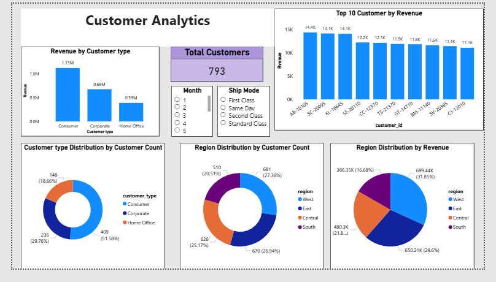

# E-commerce Sales & Customer Analytics
### Python | SQL | Power BI | MySQL | Google Colab

## 📌 Project Overview
This project analyzes 9,000+ e-commerce orders to identify revenue trends, 
product profitability, discount impact, and regional performance. The analysis 
covers end-to-end data analytics — from Python-based data cleaning and EDA, 
to SQL business queries, statistical testing, sales forecasting, and an 
interactive Power BI dashboard.

---

## 🎯 Business Objectives
- Evaluate overall sales, profit, and margin performance
- Identify top and loss-making products and categories
- Analyze discount impact on profitability
- Study regional revenue and margin contribution
- Forecast future monthly revenue trends
- Support data-driven decision-making through dashboards

---

## 📂 Dataset Information
| Column | Description |
|---|---|
| Order ID, Order Date, Ship Date | Transaction identifiers and dates |
| Customer ID, Customer Type | Consumer, Corporate, Home Office |
| Product Category, SKU, Product Name | Product classification |
| Quantity, Revenue, Profit, Discount | Financial metrics |
| Region, City, State, Ship Mode | Geographic and logistics info |

- Total Orders: 9,000+
- Total Products: 1,811 distinct SKUs
- Total Units Sold: 36,000+
- Total Revenue: $2.2M
- Total Profit: $260K
- Total Customers: 793

---

## 🛠 Tools & Technologies
| Tool | Purpose |
|---|---|
| Python (Pandas, NumPy, Seaborn, Matplotlib, Scipy) | Data cleaning, EDA, statistical analysis, forecasting |
| MySQL | Business queries and KPI analysis |
| Power BI | Interactive dashboard development |
| Google Colab | Development environment |

---

## 🔄 Project Workflow
1. Data cleaning and EDA using Python
2. Discount impact and correlation analysis
3. Sales forecasting using moving average
4. Regional statistical analysis (ANOVA test)
5. SQL queries for business KPIs
6. Power BI dashboard development
7. Insight generation and recommendations

---

## 📓 Python Analysis

### Data Cleaning & EDA
- Handled missing values and data type issues
- Verified and standardized date formats
- Performed descriptive statistics on all numeric columns
- Checked revenue, profit, and discount distributions
- Created derived columns (discount buckets, year-month period)

### Discount Impact Analysis
- Calculated correlation between discount and profit: **-0.25**
- Segmented orders into discount buckets to measure profit impact
- Found profitability turns negative beyond **20% discount threshold**

| Discount Range | Avg Profit | Total Loss |
|---|---|---|
| 0% | +$63 | — |
| 1-10% | +$96 | — |
| 11-20% | +$24 | — |
| 21-30% | -$45 | -$10,357 |
| 31-50% | -$151 | -$46,645 |
| 50%+ | -$93 | -$75,328 |

### Sales Forecasting (3-Month Moving Average)
- Built a 3-month rolling moving average forecast on monthly revenue
- Average actual monthly revenue: **$45,756**
- Forecasted avg next 3 months: **$87,156**
- Best performing month: **November 2017 ($106,883)**
- Worst performing month: **February 2014**
- Method: Moving Average chosen over Linear Regression due to 
  seasonal patterns in data

### Statistical Analysis
- Built correlation heatmap across revenue, quantity, discount, profit
- Key correlations found:
  - Revenue & Profit: **+0.40** (moderate positive)
  - Discount & Profit: **-0.25** (negative — discounts hurt profit)
  - Quantity & Profit: **+0.08** (near zero — volume alone doesn't drive profit)
- Conducted One-Way ANOVA test to validate regional revenue impact
  - F-Statistic: 0.9064 | P-Value: **0.437**
  - Result: Region alone does NOT significantly drive revenue
  - Conclusion: Discount rate and product mix are stronger profitability drivers

`notebooks/data_cleaning_eda.ipynb`

---

## 🧮 SQL Analysis
SQL queries answered the following business questions:
- Total sales, profit, quantity, and orders
- Monthly sales and profit trends
- Sales and profit by category, region, and segment
- Top customers and top-selling products by revenue
- Products with negative profit margins
- Discount impact by category
- Repeat vs low-frequency customers
- Shipping mode performance analysis

`sql_queries.sql`

---

## 📊 Power BI Dashboard

### Page 1 — Ecommerce Sales Overview

Total Revenue, Total Profit, Profit Margin %, Total Orders,
Total Quantity, Monthly Revenue Trend, Revenue by Platform,
Profit by Platform, Revenue by Product Category

### Page 2 — Product Performance Analysis

Top 10 SKUs by Revenue, Bottom 10 SKUs by Profit,
Quantity vs Profit Scatter Plot,
Product Category vs SKU Performance Table

### Page 3 — Customer Analytics

Total Customers, Revenue by Customer Type,
Customer Type Distribution, Top 10 Customers by Revenue,
Region Distribution by Customer Count and Revenue

---

## 📈 Key Insights

- **Technology** is the highest revenue-generating category;
  **Furniture SKUs** (Tables & Bookcases) generate negative profit margins
  despite significant sales volume
- **Discount is the #1 profitability killer** — correlation of -0.25 confirmed;
  orders above 20% discount consistently lose money
- **Central region** has the lowest profit margin (**6.6%**) despite $480K revenue,
  caused by highest avg discount rate of **23.8%**
- **South region** records the lowest revenue (**$366K**),
  indicating untapped market potential
- **West region** leads in both revenue (**$699K**) and profit margin (**14.2%**)
  with the lowest avg discount rate of **11%**
- **Quantity does not equal profit** — correlation between quantity and profit
  is only 0.08, meaning high-volume SKUs are not necessarily profitable
- **ANOVA test confirms** region alone does not significantly impact revenue
  (p=0.437) — product mix and discount strategy matter more
- **Q4 seasonality** is strong — November 2017 recorded peak revenue of
  **$106,883**, nearly 2.5x the historical monthly average

---

## 💡 Business Recommendations

- **Cap discounts at 20%** — data confirms profitability turns negative beyond
  this threshold across all categories and regions
- **Audit Central region pricing** — reducing avg discount from 23.8% to match
  West region's 11% could more than double the profit margin
- **Deprioritize volume-based KPIs** — shift focus to margin per order rather
  than units sold, as quantity has near-zero profit correlation
- **Invest in South region growth** — lowest revenue region with decent 13%
  margin suggests room for revenue expansion without sacrificing profitability
- **Protect Q4 momentum** — plan inventory and marketing investment around
  November-December seasonal peak
- **Review Furniture pricing strategy** — Tables and Bookcases consistently
  generate negative margins; consider price revision or discontinuation

---

## ✅ Conclusion
This project demonstrates a complete data analytics lifecycle — from raw data
cleaning to statistical analysis, forecasting, and business intelligence
dashboards. It applies Python, SQL, and Power BI to solve real business problems
around profitability, discounting strategy, and regional performance — reflecting
the analytical thinking required for data analyst roles.

